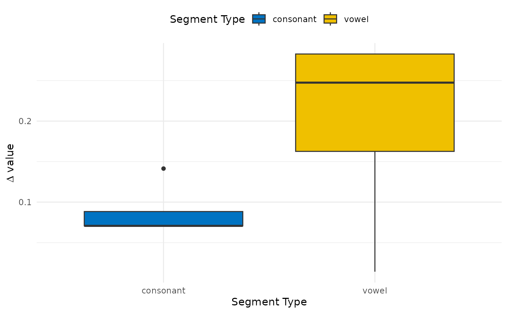
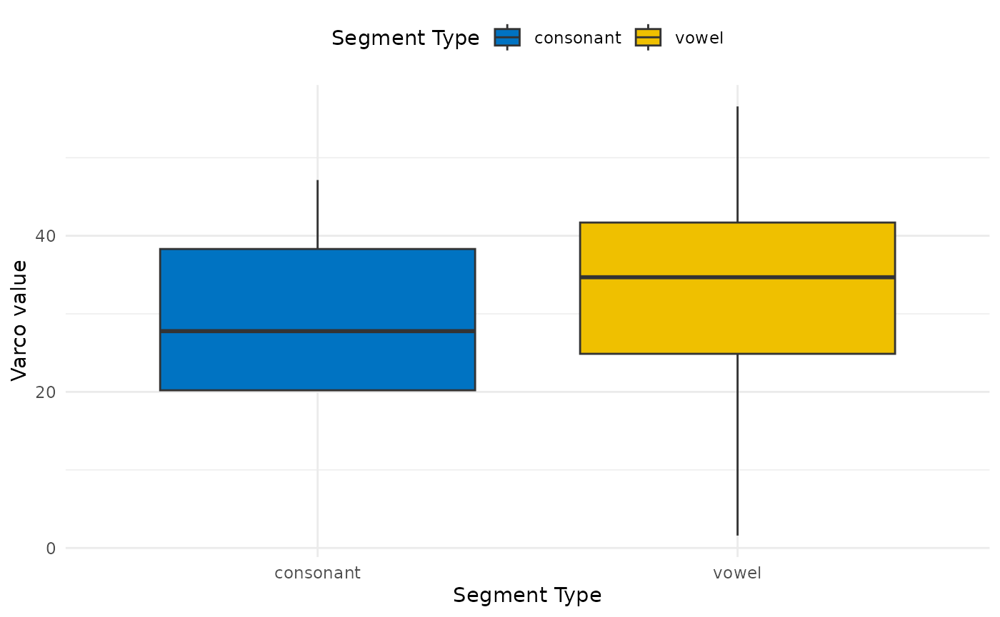
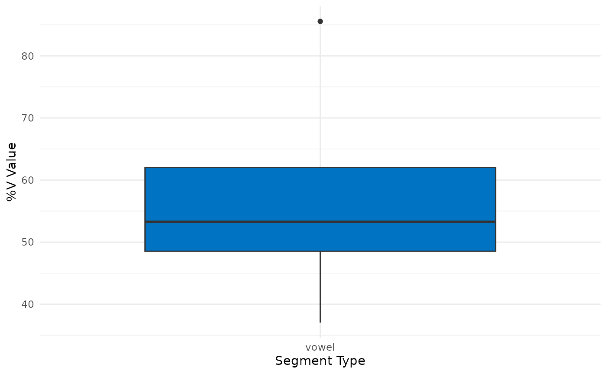
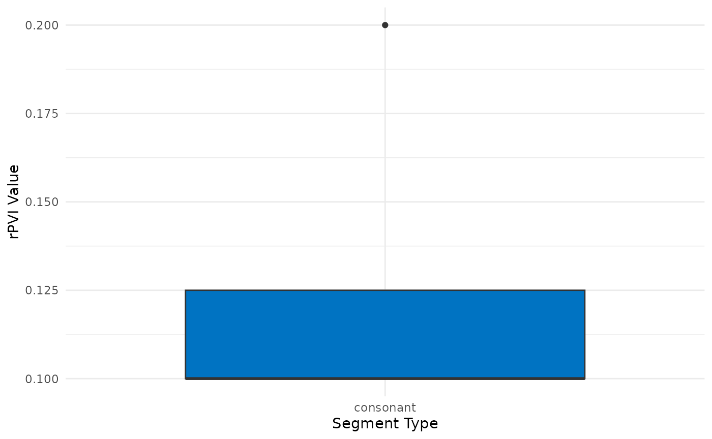
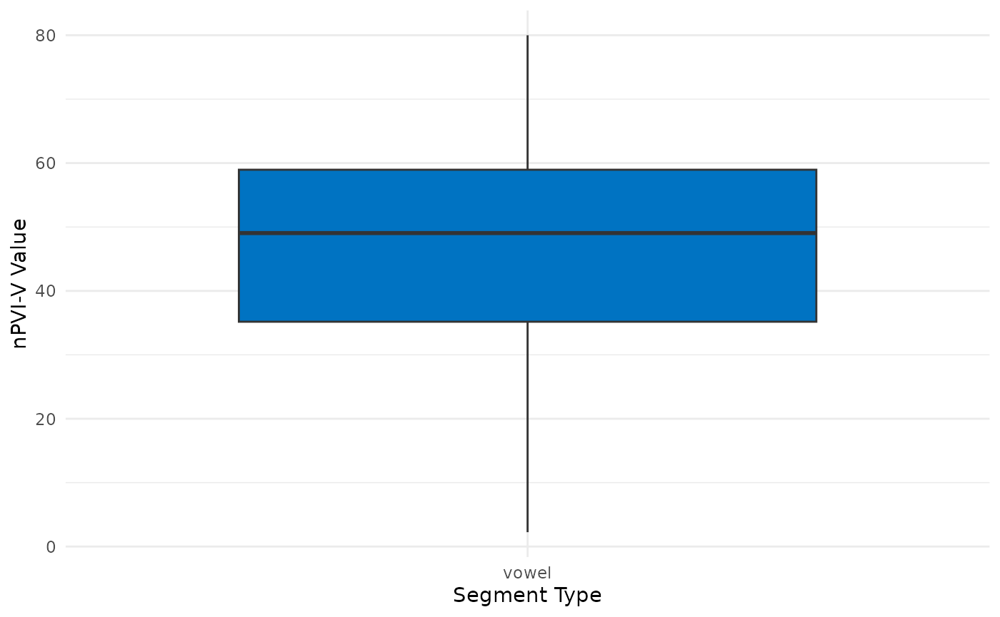

# A Guide for the R Package \`rhythm.metrics\`

## List of Functions

### Calculations

- delta_cv
- varco_cv
- percentage_v
- rpvi_c
- npvi_v

### Plotting

- plot_delta_cv
- plot_varco_cv
- plot_percentage_v
- plot_rpvi
- plot_npvi

## Installation

``` r

install.packages("devtools")
devtools::install_github("congzhang365/rhythm.metrics")
```

## Import packages

``` r

library(rhythm.metrics)
library(dplyr)
library(ggplot2)
```

## Examples

### Create dataframe

``` r

df <- data.frame (cv_label  = c("consonant", "vowel", "consonant", "vowel",
                                "consonant", "vowel", "consonant", "vowel",
                                "consonant", "vowel", "consonant", "vowel",
                                "consonant", "vowel", "consonant", "vowel"),
                  utterance_id = c("utt_1", "utt_1", "utt_1", "utt_1",
                                   "utt_2", "utt_2", "utt_2", "utt_2",
                                   "utt_3", "utt_3", "utt_3", "utt_3",
                                   "utt_4", "utt_4", "utt_4", "utt_4"),
                  cv_duration = c(0.1, 0.8, 0.2, 0.5, 
                                  0.3, 0.3, 0.4, 0.7,
                                  0.3, 0.88, 0.5, 0.9, 
                                  0.3, 0.57, 0.4, 0.97),
                  utterance_duration = c(2.4, 2.4, 2.4, 2.4,
                                         2.7, 2.7, 2.7, 2.7,
                                         3.4, 3.4, 3.4, 3.4,
                                         1.8, 1.8, 1.8, 1.8))
df
#>     cv_label utterance_id cv_duration utterance_duration
#> 1  consonant        utt_1        0.10                2.4
#> 2      vowel        utt_1        0.80                2.4
#> 3  consonant        utt_1        0.20                2.4
#> 4      vowel        utt_1        0.50                2.4
#> 5  consonant        utt_2        0.30                2.7
#> 6      vowel        utt_2        0.30                2.7
#> 7  consonant        utt_2        0.40                2.7
#> 8      vowel        utt_2        0.70                2.7
#> 9  consonant        utt_3        0.30                3.4
#> 10     vowel        utt_3        0.88                3.4
#> 11 consonant        utt_3        0.50                3.4
#> 12     vowel        utt_3        0.90                3.4
#> 13 consonant        utt_4        0.30                1.8
#> 14     vowel        utt_4        0.57                1.8
#> 15 consonant        utt_4        0.40                1.8
#> 16     vowel        utt_4        0.97                1.8
```

### delta_cv

Delta C and Delta V are rhythm metrics based on Ramus, F., Nespor, M., &
Mehler, J. (1999). Correlates of linguistic rhythm in the speech signal.
Cognition, 73(3), 265-292.

`Delta C: SD of total C duration`  
`Delta V: SD of total V duration`

``` r

delta_cv(df, cv_label, utterance_id, cv_duration)
#> # A tibble: 2 × 3
#>   cv_label  mean_delta sd_delta
#>   <chr>          <dbl>    <dbl>
#> 1 consonant     0.0884   0.0354
#> 2 vowel         0.198    0.127
```

``` r

plot_delta_cv(df, cv_label, utterance_id, cv_duration)
```



### varco_cv

Varco C and Varco V are rhythm metrics based on Dellwo, Volker (2006).
Rhythm and Speech Rate: A Variation Coefficient for deltaC. In:
Karnowski, P; Szigeti, I. Language and language-processing.
Frankfurt/Main: Peter Lang, 231-241.

`Varco C: Delta C / mean(C duration) * 100`  
`Varco V: Delta V / mean(V duration) * 100`

``` r

varco_cv(df, cv_label, utterance_id, cv_duration)
#> # A tibble: 2 × 2
#>   cv_label  varco_cv
#>   <chr>        <dbl>
#> 1 consonant     30.7
#> 2 vowel         31.9
```

``` r

plot_varco_cv(df, cv_label, utterance_id, cv_duration)
```



### percentage_v

%V is a rhythm metrics based on Ramus, F., Nespor, M., & Mehler, J.
(1999). Correlates of linguistic rhythm in the speech signal. Cognition,
73(3), 265-292. It calculates the percentage of an utterance occupied by
vocalic material.

`%V: (total V duration / total utterance duration) * 100`

``` r

percentage_v(df, v_label = "vowel", utterance_id, cv_duration, utterance_duration)
#> # A tibble: 1 × 3
#>   cv_label mean_percent_v sd_percent_v
#>   <chr>             <dbl>        <dbl>
#> 1 vowel              57.3         20.4
```

``` r

plot_percentage_v(df, cv_label, label_name = "vowel", 
                  utterance_id, cv_duration, utterance_duration)
```



### rpvi_c

rPVI C is a rhythm metrics based on Grabe, E., & Low, E. L. (2002).
Durational variability in speech and the rhythm class hypothesis. In
Laboratory phonology 7 (pp. 515-546). De Gruyter Mouton.

It calculates the sum of the absolute differences between pairs of
consecutive consonantal intervals divided by the number of pairs in the
speech sample.

``` r

rpvi_c(df, cv_label, label_name = "consonant", utterance_id, cv_duration)
#> # A tibble: 1 × 1
#>    rpvi
#>   <dbl>
#> 1 0.125
```

``` r

plot_rpvi(df, cv_label, label_name = "consonant", utterance_id, cv_duration)
```



### npvi_v

nPVI V is a rhythm metrics based on Grabe, E., & Low, E. L. (2002).
Durational variability in speech and the rhythm class hypothesis. In
Laboratory phonology 7 (pp. 515-546). De Gruyter Mouton.

It calculates the normalised sum of the absolute differences between
pairs of consecutive vocalic intervals divided by the number of pairs in
the speech sample.

``` r

npvi_v(df, cv_label, label_name = "vowel", utterance_id, cv_duration)
#> # A tibble: 1 × 1
#>    npvi
#>   <dbl>
#> 1  45.1
```

``` r

plot_npvi(df, cv_label, label_name = "vowel", utterance_id, cv_duration)
```


