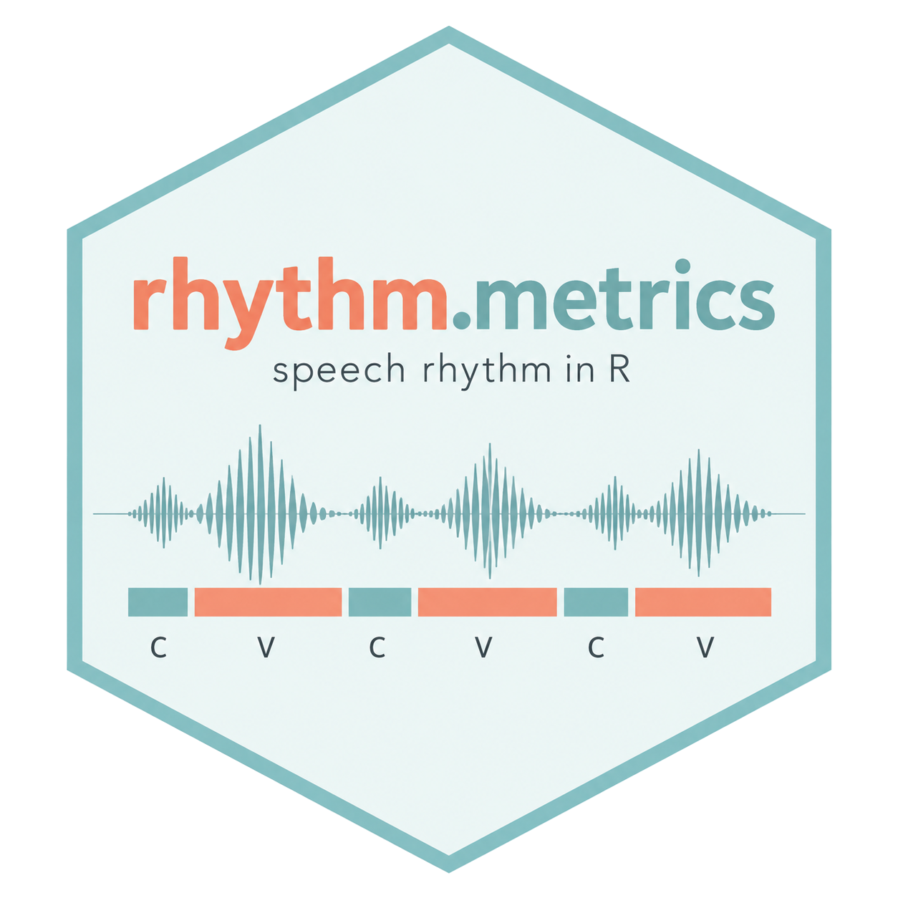

# rhythm.metrics



[](https://CRAN.R-project.org/package=rhythm.metrics)
[](https://congzhang365.github.io/rhythm.metrics/)
[](https://www.gnu.org/licenses/gpl-3.0)
[](https://doi.org/10.32614/CRAN.package.rhythm.metrics)

`rhythm.metrics`: Analyse and Visualise Speech Rhythm and Timing Metrics

This package calculates and visualises speech rhythm and timing metrics
from consonantal and vocalic interval durations. It provides a
standardised workflow to compute common metrics including `Delta C`,
`Delta V`, `Varco C`, `Varco V`, `%V`, `rPVI-C`, and `nPVI-V`, as well
as plotting functions for exploring and presenting results.

> Note: `rhythm.metrics` is under slow but active development, and
> additional metrics may be added in future releases.

## Features

- Calculate common rhythm metrics from interval-duration data
- Summarise rhythm metrics across utterances
- Visualise rhythm metrics with ready-to-use plotting functions
- Work directly with simple data frames

## Installation

You can install the released version of `rhythm.metrics` from
[CRAN](https://CRAN.R-project.org/package=rhythm.metrics) with:

``` r

install.packages("rhythm.metrics")
```

Alternatively, you can install the development version from GitHub:

``` r

install.packages("remotes")
remotes::install_github("congzhang365/rhythm.metrics")
```

## Load the Package

``` r

library(rhythm.metrics)
```

## Input Data Format

The package expects a data frame containing interval labels, utterance
identifiers, and interval durations.

A typical input data frame looks like this:

``` r

df <- data.frame(
  cv_label = c(
    "consonant", "vowel", "consonant", "vowel",
    "consonant", "vowel", "consonant", "vowel",
    "consonant", "vowel", "consonant", "vowel",
    "consonant", "vowel", "consonant", "vowel"
  ),
  utterance_id = c(
    "utt_1", "utt_1", "utt_1", "utt_1",
    "utt_2", "utt_2", "utt_2", "utt_2",
    "utt_3", "utt_3", "utt_3", "utt_3",
    "utt_4", "utt_4", "utt_4", "utt_4"
  ),
  cv_duration = c(
    0.10, 0.80, 0.20, 0.50,
    0.30, 0.30, 0.40, 0.70,
    0.30, 0.88, 0.50, 0.90,
    0.30, 0.57, 0.40, 0.97
  ),
  utterance_duration = c(
    2.4, 2.4, 2.4, 2.4,
    2.7, 2.7, 2.7, 2.7,
    3.4, 3.4, 3.4, 3.4,
    1.8, 1.8, 1.8, 1.8
  )
)
```

## Available Functions

| Category | Function | Description |
|----|----|----|
| Calculation | [`delta_cv()`](https://congzhang365.github.io/rhythm.metrics/reference/delta_cv.md) | Calculate Delta C and Delta V |
| Calculation | [`varco_cv()`](https://congzhang365.github.io/rhythm.metrics/reference/varco_cv.md) | Calculate Varco C and Varco V |
| Calculation | [`percentage_v()`](https://congzhang365.github.io/rhythm.metrics/reference/percentage_v.md) | Calculate percentage of vocalic intervals (%V) |
| Calculation | [`rpvi_c()`](https://congzhang365.github.io/rhythm.metrics/reference/rpvi_c.md) | Calculate raw Pairwise Variability Index for consonants |
| Calculation | [`npvi_v()`](https://congzhang365.github.io/rhythm.metrics/reference/npvi_v.md) | Calculate normalised Pairwise Variability Index for vowels |
| Plotting | [`plot_delta_cv()`](https://congzhang365.github.io/rhythm.metrics/reference/plot_delta_cv.md) | Plot Delta C and Delta V |
| Plotting | [`plot_varco_cv()`](https://congzhang365.github.io/rhythm.metrics/reference/plot_varco_cv.md) | Plot Varco C and Varco V |
| Plotting | [`plot_percentage_v()`](https://congzhang365.github.io/rhythm.metrics/reference/plot_percentage_v.md) | Plot %V |
| Plotting | [`plot_rpvi()`](https://congzhang365.github.io/rhythm.metrics/reference/plot_rpvi.md) | Plot rPVI-C |
| Plotting | [`plot_npvi()`](https://congzhang365.github.io/rhythm.metrics/reference/plot_npvi.md) | Plot nPVI-V |

## Quick Start

### Delta C and Delta V

Delta C and Delta V are rhythm metrics based on:

Ramus, F., Nespor, M., & Mehler, J. (1999). Correlates of linguistic
rhythm in the speech signal. *Cognition, 73*(3), 265-292.

- Delta C: standard deviation of consonantal interval durations
- Delta V: standard deviation of vocalic interval durations

``` r

delta_cv(df, cv_label, utterance_id, cv_duration)
```

``` r

plot_delta_cv(df, cv_label, utterance_id, cv_duration)
```

### Varco C and Varco V

Varco C and Varco V are based on:

Dellwo, V. (2006). Rhythm and Speech Rate: A Variation Coefficient for
deltaC. In P. Karnowski & I. Szigeti (Eds.), *Language and
language-processing* (pp. 231-241). Peter Lang.

- Varco C: Delta C / mean consonant duration \* 100
- Varco V: Delta V / mean vowel duration \* 100

``` r

varco_cv(df, cv_label, utterance_id, cv_duration)
```

``` r

plot_varco_cv(df, cv_label, utterance_id, cv_duration)
```

### Percentage of Vocalic Intervals (%V)

%V is based on:

Ramus, F., Nespor, M., & Mehler, J. (1999). Correlates of linguistic
rhythm in the speech signal. *Cognition, 73*(3), 265-292.

It measures the percentage of total utterance duration occupied by
vocalic material.

``` r

percentage_v(df, v_label = "vowel", utterance_id, cv_duration, utterance_duration)
```

``` r

plot_percentage_v(df, cv_label, label_name = "vowel", 
                  utterance_id, cv_duration, utterance_duration)
```

### rPVI-C

rPVI-C is based on:

Grabe, E., & Low, E. L. (2002). Durational variability in speech and the
rhythm class hypothesis. In *Laboratory Phonology 7* (pp. 515-546). De
Gruyter Mouton.

It calculates the average absolute difference between consecutive
consonantal intervals.

``` r

rpvi_c(df, cv_label, label_name = "consonant", utterance_id, cv_duration)
```

``` r

plot_rpvi(df, cv_label, label_name = "consonant", utterance_id, cv_duration)
```

### nPVI-V

nPVI-V is based on:

Grabe, E., & Low, E. L. (2002). Durational variability in speech and the
rhythm class hypothesis. In *Laboratory Phonology 7* (pp. 515-546). De
Gruyter Mouton.

It calculates the normalised average absolute difference between
consecutive vocalic intervals.

``` r

npvi_v(df, cv_label, label_name = "vowel", utterance_id, cv_duration)
```

``` r

plot_npvi(df, cv_label, label_name = "vowel", utterance_id, cv_duration)
```

## Example Workflow

A simple workflow with the package might look like this:

``` r

library(rhythm.metrics)

df <- data.frame(
  cv_label = c(
    "consonant", "vowel", "consonant", "vowel",
    "consonant", "vowel", "consonant", "vowel",
    "consonant", "vowel", "consonant", "vowel",
    "consonant", "vowel", "consonant", "vowel"
  ),
  utterance_id = c(
    "utt_1", "utt_1", "utt_1", "utt_1",
    "utt_2", "utt_2", "utt_2", "utt_2",
    "utt_3", "utt_3", "utt_3", "utt_3",
    "utt_4", "utt_4", "utt_4", "utt_4"
  ),
  cv_duration = c(
    0.10, 0.80, 0.20, 0.50,
    0.30, 0.30, 0.40, 0.70,
    0.30, 0.88, 0.50, 0.90,
    0.30, 0.57, 0.40, 0.97
  ),
  utterance_duration = c(
    2.4, 2.4, 2.4, 2.4,
    2.7, 2.7, 2.7, 2.7,
    3.4, 3.4, 3.4, 3.4,
    1.8, 1.8, 1.8, 1.8
  )
)

# Analysis
delta_cv(df, cv_label, utterance_id, cv_duration)
varco_cv(df, cv_label, utterance_id, cv_duration)
percentage_v(df, v_label = "vowel", utterance_id, cv_duration, utterance_duration)
rpvi_c(df, cv_label, label_name = "consonant", utterance_id, cv_duration)
npvi_v(df, cv_label, label_name = "vowel", utterance_id, cv_duration)

# Visualisation
plot_delta_cv(df, cv_label, utterance_id, cv_duration)
plot_varco_cv(df, cv_label, utterance_id, cv_duration)
plot_percentage_v(df, cv_label, label_name = "vowel", 
                  utterance_id, cv_duration, utterance_duration)
plot_rpvi(df, cv_label, label_name = "consonant", utterance_id, cv_duration)
plot_npvi(df, cv_label, label_name = "vowel", utterance_id, cv_duration)
```

## Documentation

For more detailed examples and usage notes, see the package vignette and
function help pages after installation.

``` r

?delta_cv
?varco_cv
?percentage_v
?rpvi_c
?npvi_v
```

## Citation

If you use `rhythm.metrics` in your research, please cite both the
software package version and the original package guide.

### Software

Zhang, C. (2026). *rhythm.metrics: Analyse and Visualise Speech Rhythm
and Timing Metrics* (Version 1.1.0) \[R package\]. CRAN.
<https://doi.org/10.32614/CRAN.package.rhythm.metrics>

You can also obtain the package citation from R with:

``` r

citation("rhythm.metrics")
```

### Package guide

Zhang, C. (2022). *A Guide for the R Package “rhythm_metrics”*. OSF
Preprints. <https://doi.org/10.31219/osf.io/kfnzt>

BibTeX for the 2022 guide:

``` bibtex
@misc{zhang2022,
  title  = {A Guide for the R Package "rhythm_metrics"},
  author = {Zhang, Cong},
  year   = {2022},
  doi    = {10.31219/osf.io/kfnzt},
  url    = {https://doi.org/10.31219/osf.io/kfnzt}
}
```

## Research Using rhythm.metrics

The following studies have used rhythm.metrics in their analysis:

- Laméris, T. J., & Kubota, M. (2026). L1 phonetic reversal and L2
  phonetic attrition in Japanese–English bilingual returnee children
  over the course of five years: an acoustic study. *Second Language
  Research*. <https://doi.org/10.1177/02676583261461940>
- Sun, Y., & Zhang, C. (2022). Task effect on L2 rhythm production by
  Cantonese learners of Portuguese. *DELTA: Documentação de Estudos em
  Lingüística Teórica e Aplicada*, 38(3), 202258943.
  <https://doi.org/10.1590/1678-460X202258943>

> If you have published work using `rhythm.metrics` and would like it
> listed here, please feel free to open an issue or pull request.

## Contributing

Bug reports, feature requests, and suggestions are welcome. If you
encounter an issue or would like to suggest an additional metric, please
open an issue on GitHub or email me at <cong.zhang@newcastle.ac.uk>

## License

GPL-3
